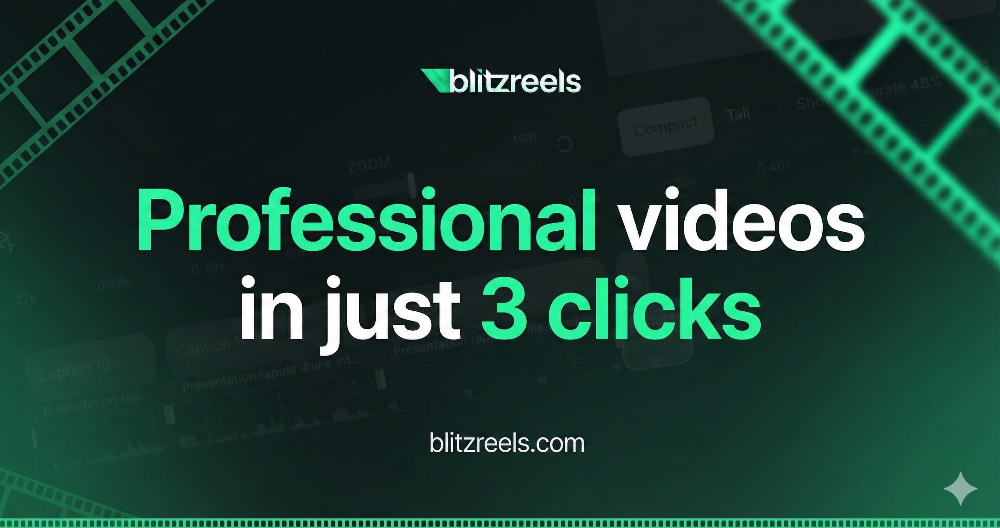
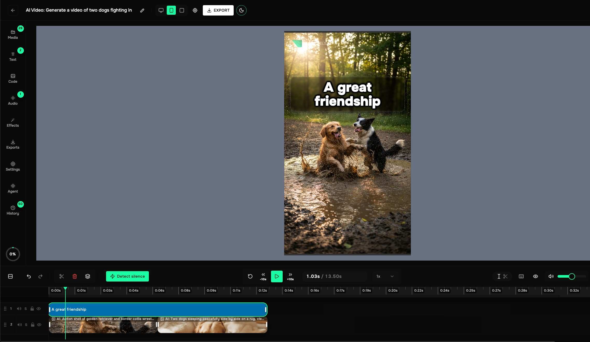
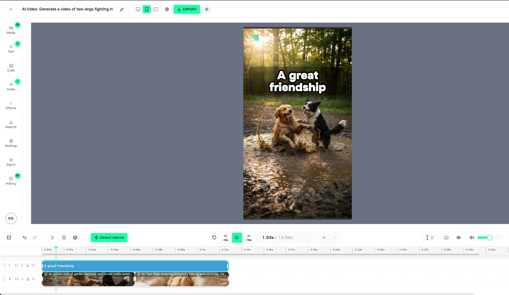

# BlitzReels Agent Skills

<p align="center">
  
</p>

Turn your AI coding agent into a BlitzReels video API operator.

[BlitzReels](https://blitzreels.com) is a full-fledged AI video editing app and developer platform with a public REST API.  
Teams use BlitzReels to generate, edit, and export production-ready short-form videos with timeline controls, captions, overlays, media management, and automation workflows for TikTok, Instagram Reels, and YouTube Shorts.

This repository packages installable **Agent Skills** (instructions + helper scripts) for AI coding agents (Codex, Claude Code, Cursor, and others), so agents can:

- discover the right BlitzReels API endpoints quickly
- follow production-ready workflow patterns
- use the OpenAPI contract instead of guessing payloads

If you want AI agents to build real video workflows against BlitzReels, this repo is the entrypoint.

## What is BlitzReels?

BlitzReels combines an end-user video editor and a developer-first API:

- Full video editing app with timeline, media library, captions, effects, and export controls.
- AI generation workflows for faceless videos, carousels, b-roll, and motion graphics.
- Public API + OpenAPI contract for building your own video products and automations.
- Learn more at https://blitzreels.com
- API docs: https://blitzreels.com/docs
- OpenAPI spec: https://blitzreels.com/api/openapi.json

## SEO Use Cases (What BlitzReels Helps You Build)

- **TikTok clipping tool**: turn long-form videos into short, publish-ready clips.
- **Instagram clipping tool**: repurpose podcasts, streams, and courses into Reels.
- **TikTok/Instagram captioning tool**: auto-captions with word-level timing and 34 built-in caption presets.
- **Short-form video editor**: timeline editing, safe zones, and HD exports with no watermarks.
- **3-step workflow**: upload, caption, export in ~3 minutes on average.

## UI Screenshots

| Editor (Dark) | Editor (Light) |
| --- | --- |
|  |  |

## LLM Resources (On blitzreels.com)

- `https://blitzreels.com/llms.txt` (concise)
- `https://blitzreels.com/llms-full.txt` (expanded)
- `https://blitzreels.com/api/openapi.json` (canonical API contract)

## Skills

- `blitzreels` - Core BlitzReels API skill (auth, endpoint discovery, OpenAPI-aware guidance).
- `blitzreels-faceless` - Faceless video generation workflows (voices, visual styles, jobs, exports).
- `blitzreels-video-editing` - TikTok/Instagram clipping and captioning workflows (timeline, captions, overlays, exports).
- `blitzreels-motion-graphics` - Timeline editing + motion graphics workflows (overlays, templates, export).
- `blitzreels-carousels` - Carousel project workflows for short-form platforms (slide + text overlay pipelines).
- `blitzreels-carousels-tiktok` - TikTok carousel wrapper (defaults + helper script).
- `blitzreels-carousels-instagram` - Instagram carousel wrapper (defaults + helper script).

## Installation

If you publish this folder as its own GitHub repo (recommended), users can install it via the Skills CLI:

```bash
npx skills add blitzreels/agent-skills --skill blitzreels
```

List skills in the repo:

```bash
npx skills add blitzreels/agent-skills --list
```

## Development

Each skill lives in `skills/<skill-name>` and includes:

- `SKILL.md` - agent instructions
- `scripts/` - helper scripts (optional)
- `examples/` - usage examples (optional)

## License

MIT
